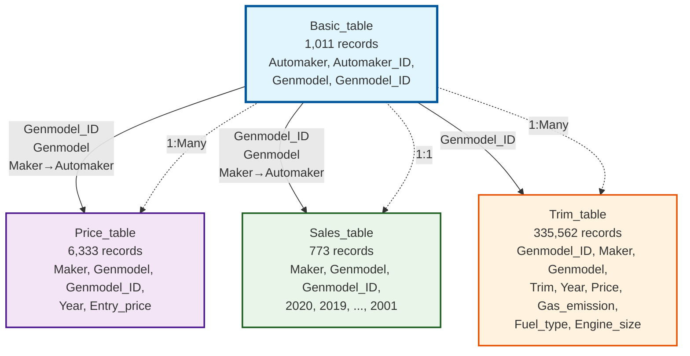

# Car Dataset Entity Relationship Analysis

This document contains an automatically generated diagram that describes the inferred relationships between CSV tables in the car analysis project.

## Dataset Overview

The dataset consists of 4 CSV files containing car-related information:

- **Basic_table.csv**: Central reference table with 1,011 unique car models
- **Price_table.csv**: Entry prices by model and year (6,333 records)
- **Sales_table.csv**: Sales data by model and year 2001-2020 (773 records)
- **Trim_table.csv**: Detailed trim specifications (335,562 records)

## Schema Analysis

### Key Columns Identified:
- **Primary Keys**: `Genmodel_ID` (unique identifier for car models)
- **Foreign Keys**: `Maker`/`Automaker` (car manufacturer), `Genmodel` (model name)
- **Naming Inconsistencies**: `Maker` vs `Automaker`, whitespace in column names

### Data Quality Issues:
- Column name inconsistencies between tables
- Leading whitespace in Ad_table column names (e.g., `' Genmodel_ID'`)
- Different naming conventions for the same entity

## Entity Relationship Diagram

## Relationship Details

### Primary Relationships:
1. **Basic_table** → **All other tables** (Central hub)
   - **Join Key**: `Genmodel_ID` (primary identifier)
   - **Additional Keys**: `Genmodel`, `Maker`/`Automaker` (with name mapping)

### Cardinality Analysis:
- **Basic → Price**: 1:Many (one model, multiple price entries by year)
- **Basic → Trim**: 1:Many (one model, multiple trim variants)
- **Basic → Sales**: 1:1 (one model, one sales record with yearly breakdown)

### Data Volume:
- **Central Table**: 1,011 unique car models
- **Largest Table**: Trim_table (335K records)
- **Most Complex**: Trim_table (9 columns with detailed specifications)

## Merge Strategy Recommendations

1. **Start with Basic_table** as the central reference
2. **Aggregate large tables** (Trim) before merging to prevent cartesian explosion
3. **Handle naming inconsistencies** by standardizing `Maker` → `Automaker`
4. **Clean column names** (remove leading whitespace)
5. **Use appropriate join types** (LEFT JOIN to preserve all models)

## Data Quality Considerations

- **Coverage**: Not all models have data in all tables
- **Consistency**: Different naming conventions require standardization
- **Completeness**: Sales data available for only 773/1,011 models
- **Memory Management**: Trim table requires aggregation strategies
